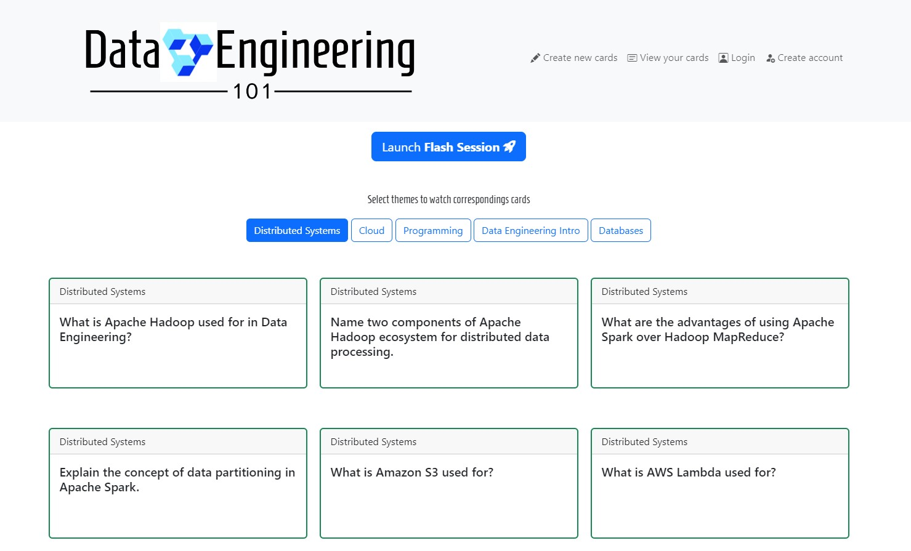
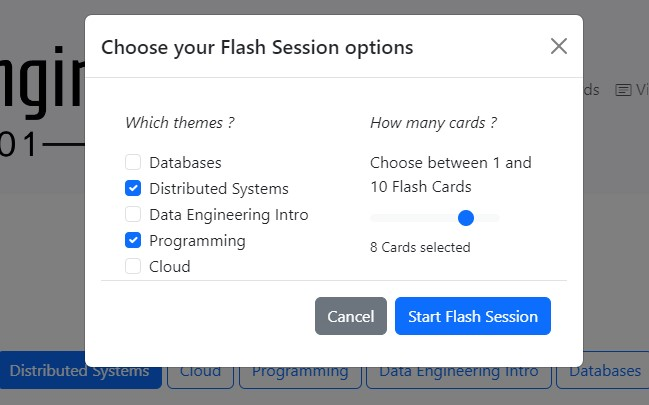

# Learn the basics about APIs, RDBMS, Docker & more : a small webapp
[](https://github.com/Stephd91/FastAPI/actions/workflows/ci.yml)
[](https://github.com/Stephd91/FastAPI/actions/workflows/cd.yml)
<p align="center"></p>
<p align="center">
   
   
</p>

This repository contains a FastAPI web application for anyone who wants to learn about how to create a REST API and training  📚.\
The app is composed of a backend **FastAPI - SQLAlchemy - PostgreSQL** combined with a server side rendering **Jinja2** and a simple web server **Uvicorn**. The API is containerized with **Docker** and works with a PostgreSQL database which may also be ran in another Docker container with the help of **Docker Compose**.\
Here is the project's schema architecture :
<p align="center"></p>
<!--  -->
<!--  -->

## Table of Contents

- [Prerequisites](#prerequisites)
- [Project structure](#project-structure)
- [Setup](#setup)
- [CI/CD Pipeline](#cicd-pipeline)
- [API Reference](#api-reference)
- [Lessons learned](#lessons-learned)
- [Next steps](#next-steps)

## Prerequisites

Before you begin, ensure you have met the following requirements:

- [Python](https://www.python.org/downloads/) (3.10 or higher)
- [Docker](https://www.docker.com/products/docker-desktop)
- [GitHub account](https://github.com/)

<hr>

## Project structure


- app: Contains the main application code (main.py), handles dependencies and data import from a provided csv
   - app/alembic: Alembic migration scripts for database management
   - app/config: Database initialization and session management
   - app/crud: Contains the crud operations on each entity
   - app/models: Data models for Cards, Themes, Users, Flash session
   - app/nodes_modules: Bootstrap stuffs
   - app/routers: Defines the API routes
   - app/schemas: Pydantic validation models for Cards, Themes, Users, Flash session
   - app/static: CSS and JS files for server-side rendering
   - app/templates: Jinja2 templates for front-end
- db: Your database password (inside password.txt) to provide to Docker Compose  
- tests: Unit tests for your application

<hr>

## Setup
1. Clone the git repository then go to the root directory :

   ```bash
   git clone https://github.com/Stephd91/FastAPI.git
   cd FastAPI
   ```
2. Create a .env file that will hold your database connection infos :
   ```bash
   cd app
   touch .env
   ```
3. Inside the .env, list the following environment variables that will be called by the *config/config_sqlalchemy.py* script :
```bash
DB_USER=postgres
DB_PASSWORD=yourpassword
DB_HOST=db
DB_PORT=5432
DB_NAME=learn_de
```
🔒 A more secure mechanism than passing sensitive information via environment variables is to use [secrets in Docker Compose](https://docs.docker.com/compose/use-secrets/). In most cases, these secrets are mounted as files in the running container. Many apps also support env vars with a _FILE suffix to point to a file containing the variable.
<blockquote>Docker Compose provides a way for you to use secrets without having to use environment variables to store information. If you’re injecting passwords and API keys as environment variables, you risk unintentional information exposure. Environment variables are often available to all processes, and it can be difficult to track access. They can also be printed in logs when debugging errors without your knowledge. Using secrets mitigates these risks.</blockquote>

4. Build the API's Docker Image with the help of the Dockerfile to build a new image.

  ```bash
  docker build -t fastapiproject:v1.0.0 .
  ```

Now that the API is dockerized, there are 2 options to see the web app running on your localhost 🖥️: 

**Option 1 : use 2 independants Docker containers**\
1. Run PostgreSQL in a container using the following docker run command.
  ```bash
  docker run --rm \
  --mount type=volume,src=db-data,target=/var/lib/postgresql/data \
  -p 5432:5432 \
  --network postgresnet \
  --name db \
  -e POSTGRES_PASSWORD=yourpassword \
  -e POSTGRES_DB=learn_de \
  postgres
  ```

2. Run the application in a container using the docker run command. 
The command *--network postgrenet* allow to create a network connection with PostgreSQL

  ```bash
  docker run --rm -d \
  --network postgresnet \
  --name rest-server \
  -p 80:80 \
  -e POSTGRES_PASSWORD=yourpassword \
  fastapiproject:v1.0.0
  ```

**Option 2 : use Docker Compose to continue your local dev**\
1. Open the *compose.yaml* file (placed at the root directory)
2. Verify the ports for the server (should be 80:80) and for the database (should be 5432)
3. At the root directory, create a "db" directory and place a *password.txt* file inside that will hold the database password to allwo Docker Compose to run the postgres container

```bash
  mkdir db && cd db
  echo "yourpassword" > password.txt
  docker compose up --build
```

Verify the deployment by navigating to your server address in your preferred browser.
Frontend : http://localhost:80
Automatic interactive documentation with Swagger UI (from the OpenAPI backend): http://localhost:80/docs
  ```bash
  127.0.0.1:80
  ```

<hr>

## CI/CD Pipeline
Automatically build and tag a Docker image and test it with GitHub Actions
1. Go to your GitHub repo > Actions tab. Then select *set up a workflow yourself*. This takes you to a page for creating a new GitHub actions workflow file in your repository, under *.github/workflows/main.yml* by default.
Or run the following command in your terminal :
```bash
mkdir -p .github/workflows
cd .github/workflows
```
2. In the editor window, copy and paste the following config in a ci.yml file (you should have previously created a Docker [Personal Acces Token](https://docs.docker.com/docker-hub/access-tokens/)) :

  ```bash
name: CI Pipeline
run-name: ${{ github.workflow }}
on: 
  workflow_dispatch: # Manually running a workflow from the UI
  push:
    tags:
      - '*'

jobs:
  build:
    runs-on: ubuntu-latest
    steps:
      -
        name: Checkout
        uses: actions/checkout@v4
      -
        name: Login to Docker Hub
        uses: docker/login-action@v3
        with:
          username: ${{ secrets.DOCKERHUB_USERNAME }}
          password: ${{ secrets.DOCKERHUB_TOKEN }}
      -
        name: Set up Docker Buildx
        uses: docker/setup-buildx-action@v3
      -
        name: Build and push
        uses: docker/build-push-action@v5
        with:
          context: .
          file: ./Dockerfile
          push: true
          tags: ${{ secrets.DOCKERHUB_USERNAME }}/clockbox:latest
  ```
3. Then you can create a cd.yml file :
```bash
name: CD Pipeline
run-name: ${{ github.workflow }}
on:
  workflow_dispatch: # Manually running a workflow from the UI  
  workflow_run:
    workflows: ["CI Pipeline"]
    types:
      - completed

jobs:
  deploy:
    runs-on: ubuntu-latest

    steps: # Lets start our web app from the docker compose file 
    -     
      name: Login to Docker Hub
      uses: docker/login-action@v3
      with:
        username: ${{ secrets.DOCKERHUB_USERNAME }}
        password: ${{ secrets.DOCKERHUB_TOKEN }}
    -
      name: Pull the latest image from Docker Hub
      run: docker pull ${{ secrets.DOCKERHUB_USERNAME }}/fastapiproject:latest

    -
      name: Checkout # Cloning repository to the runner
      uses: actions/checkout@v4
    -
      name: Add databased credentials to allow API connection 
      working-directory: .
      run: |
        mkdir db
        cd db
        echo "yourpassword" > password.txt
    -
      name: Add .env file for SQLalchemy connection
      working-directory: ./app
      run: |
        echo -e "DB_USER=postgres\nDB_PASSWORD=yourpassword\nDB_HOST=db\nDB_PORT=5432\nDB_NAME=learn_de" > .env
    - 
      name: Deploy with Docker Compose Action
      uses: isbang/compose-action@v1.5.1
      with:
        compose-file: "./compose.yaml"
```

4. Create a git tag and push to your GitHub repo. This will automatically run your CI/CD pipeline :
  ```bash
  git tag -a v1.0.0 -m "Release version 1.0.0"
  git push origin v1.0.0
  ```

<hr>

## API Reference

#### Get the homepage

```http
  GET /app
```
Render the homepage app.html from Jinja2 to navigate through cards and their associated themes, go the other routes from here (create a card, launch a flash-session)


#### Get flash session through UI

```http
  POST /flash-session
```

| Parameter | Type     | Description                       |
| :-------- | :------- | :-------------------------------- |
| `theme(s)`      | `string` | **Required**. List of themes selected in the "Start Flash Session"popup  |
| `num_cards`      | `int` | **Required**. Nb of cards selected in the "Start Flash Session"popup |

#### Create a card through UI
```http
  POST /create-card
```

#### Modify a card
```http
  PUT /modify-card/{card_id}
```

#### Delete a card
```http
  DELETE /delete-card/{card_id}
```

<hr>

## Lessons Learned

Building this project from scratch, I could learn a lot about how API is built to exchange with its clients and its backend database.
Here are the skills I have learned from this project :
* 📌 **Database**:
  * ✅ PostgreSQL handling with CLI
  * ✅ UML diagram and entity relationships in a relational database
  * ✅ Alembic migrations
* 📌 **Python & API** :
  * ✅ SQLALchemy ORM language
  * ✅ Endpoint logic with FastAPI and crud operations
  * ✅ Pydantic model validation
  * ✅ Unit testing with pytest
* 📌 **Front-end** :
  * ✅ Some Bootstrap, HTML and Javascript coding
* 📌 **Deployment** :
  * ✅ Used "decouple" package to hide connection infos with environment variables
  * ✅ Dockerization and Docker Compose for multi containers app
  * ✅ CI/CD pipeline with GitHub Actions

<hr>

## Next steps
For the next steps in this project, these functionnalities could be developed:
* Implement user authentication with JWT tokens to allow users to create, edit, and review their own cards
* Provide a fully automated pipeline to ingest data from external sources (ChatGPT, websites, ...)
* Use a NoSQL Database instead of PostgreSQL in order to provide images or GIFs in the cards