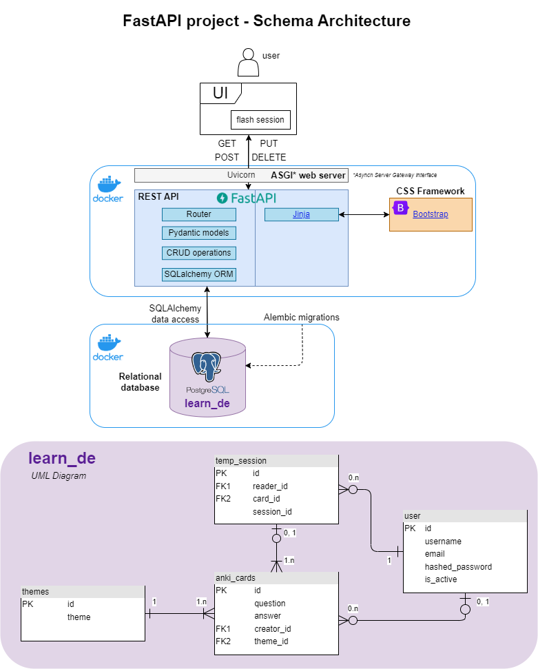

# Learn the basics about APIs, RDBMS, Docker & more : a small webapp

\
This repository contains a FastAPI web application for anyone who wants to learn about how to create an  and training  📚.\
The app is composed of a **FastAPI - SQLAlchemy - PostgreSQL** backend combined with a server side rendering **Jinja2** and a simple web **Uvicorn** web server. The API is containerized with **Docker**.\
Here is the project's schema architecture :\

<!--  -->

## Table of Contents

- [Prerequisites](#prerequisites)
- [Setup](#setup)
- [Project structure](#project-structure)
- [Dockerization](#dockerization)
- [CI/CD Pipeline](#cicd-pipeline)
- [API Reference](#api-reference)
- [Lessons learned](#lessons-learned)

## Prerequisites

Before you begin, ensure you have met the following requirements:

- [Python](https://www.python.org/downloads/) (3.9 or higher)
- [Docker](https://www.docker.com/products/docker-desktop)
- [GitHub account](https://github.com/)

## Setup
Clone the repository then go to the root directory :

   ```bash
   git clone https://github.com/Stephd91/FastAPI.git
   cd FastAPI
   ```
Create a .env file that will hold your database connection infos :
   ```bash
   cd app
   touch .env
   ```
Inside the .env, list the following environment variables that will be called by the *config/config_sqlalchemy.py* script :
```bash
DB_USER=postgres
DB_PASSWORD=yourpassword
DB_HOST=db\
DB_PORT=5432\
DB_NAME=learn_de
```
⚠️ A more secure mechanism is to use the secret support provided by your container orchestration framework. In most cases, these secrets are mounted as files in the running container. You'll see many apps also support env vars with a _FILE suffix to point to a file containing the variable.

**Option 1 : use 2 independants containers to see the web app running**\
1. Run PostgreSQL in a container using the following docker run command.
  ```bash
  docker run --rm -d \
  --mount type=volume,src=db-data,target=/var/lib/postgresql/data \
  -p 5432:5432 \ --network postgresnet \
  --name db \
  -e POSTGRES_PASSWORD=postgres \
  -e POSTGRES_DB=example\
  postgres 
  ```

2. Run the application in a container using the docker run command. 
The command *--network postgrenet* allow to create a network connection with PostgreSQL

  ```bash
  docker run --rm -d \
  --network postgresnet \
  --name rest-server \
  -p 80:80 \
  -e POSTGRES_PASSWORD=yourpassword \
  fastapiproject:v1.0.0
  ```

**Option 2 : use Docker Compose to continue your local dev**\
1. Open the *compose.yaml* file (placed at the root directory)
2. Verify the ports for the server (should be 80:80) and for the database (should be 5432)
3. At the root directory, create a "db" directory and place a *password.txt* file inside that will hold the database password to allwo Docker Compose to run the postgres container

```bash
  mkdir db && cd db
  echo "mypostgresqlpassword" > password.txt
  docker compose up --build
```

Verify the deployment by navigating to your server address in your preferred browser.
Frontend : http://localhost:80
Automatic interactive documentation with Swagger UI (from the OpenAPI backend): http://localhost:80/docs
  ```bash
  127.0.0.1:80
  ```

<hr>

## Project structure
- app: Contains the main application code (main.py), handles dependencies and data import from a provided csv
- app/routers: Defines the API routes.
- app/models: Data models for Cards, Themes, Users, Flash session
- app/schemas: Pydantic validation models for Cards, Themes, Users, Flash session
- app/crud: Contains the crud operations on each entity
- app/config: Database initialization and session management.
- app/templates: Jinja2 templates for front-end.
- app/alembic: Alembic migration scripts for database management.
- tests: Unit tests for your application.

<hr>

## Dockerization
<!--  -->
After the changes you made to the app (new routes, new crud operations, ...), 
you can build the Docker Image of your modified FastAPI. The docker build command uses the Dockerfile to build a new image.
Then run the application in a Container using the docker run command. You can use a tag for your Docker image (eg. v1.1.0)

  ```bash
  docker build -t fastapiproject .
  docker run -d --name fastapicontainer -p 80:80 fastapiproject:v1.1.0
  ```

Or you can use Docker Compose as explained in [Setup](#setup)

<hr>

## CI/CD Pipeline
Automatically build and tag a Docker image and test it with GitHub Actions
1. Go to your GitHub repo > Actions tab
2. Select set up a workflow yourself. This takes you to a page for creating a new GitHub actions workflow file in your repository, under .github/workflows/main.yml by default.
3. In the editor window, copy and paste the following YAML configuration (you should have previously created a Docker [Personal Acces Token](https://docs.docker.com/docker-hub/access-tokens/)) :

  ```bash
name: CI/CD Pipeline

on: 
  push:
    tags:
      - '*'

jobs:
  build:
    runs-on: ubuntu-latest
    steps:
      -
        name: Checkout
        uses: actions/checkout@v4
      -
        name: Login to Docker Hub
        uses: docker/login-action@v3
        with:
          username: ${{ secrets.DOCKERHUB_USERNAME }}
          password: ${{ secrets.DOCKERHUB_TOKEN }}
      -
        name: Set up Docker Buildx
        uses: docker/setup-buildx-action@v3
      -
        name: Build and push
        uses: docker/build-push-action@v5
        with:
          context: .
          file: ./Dockerfile
          push: true
          tags: ${{ secrets.DOCKERHUB_USERNAME }}/clockbox:latest
  ```
4. Create a git tag and push to your GitHub repo :
  ```bash
  git tag -a v1.0.0 -m "Release version 1.0.0"
  git push origin v1.0.0
  ```

<hr>

## API Reference

#### Get the homepage

```http
  GET /app
```
Render the homepage app.html from Jinja2 to navigate through cards and their associated themes, go the other routes from here (create a card, launch a flash-session)


#### Get flash session through UI

```http
  POST /flash-session
```

| Parameter | Type     | Description                       |
| :-------- | :------- | :-------------------------------- |
| `theme(s)`      | `string` | **Required**. List of themes selected in the "Start Flash Session"popup  |
| `num_cards`      | `int` | **Required**. Nb of cards selected in the "Start Flash Session"popup |

#### Create a card through UI
```http
  POST /create-card
```

#### Modify a card
```http
  PUT /modify-card/{card_id}
```

#### Delete a card
```http
  DELETE /delete-card/{card_id}
```

<hr>

## Lessons Learned

Building this project from scratch, I could learn a lot about how API is built to exchange with its clients and its backend database.
Here are the skills I have learned from this project :
* 📌 **Database**:
  * ✅ PostgreSQL handling with CLI
  * ✅ UML diagram and entity relationships in a relational database
  * ✅ Alembic migrations
* 📌 **Python & API** :
  * ✅ SQLALchemy ORM language
  * ✅ Endpoint logic with FastAPI and crud operations
  * ✅ Pydantic model validation
  * ✅ Unit testing with pytest
* 📌 **Front-end** :
  * ✅ Some Bootstrap, HTML and Javascript coding
* 📌 **Deployment** :
  * ✅ Used "decouple" package to hide connection infos with environment variables
  * ✅ Dockerization and Docker Compose for multi containers app
  * ✅ CI/CD pipeline with GitHub Actions

